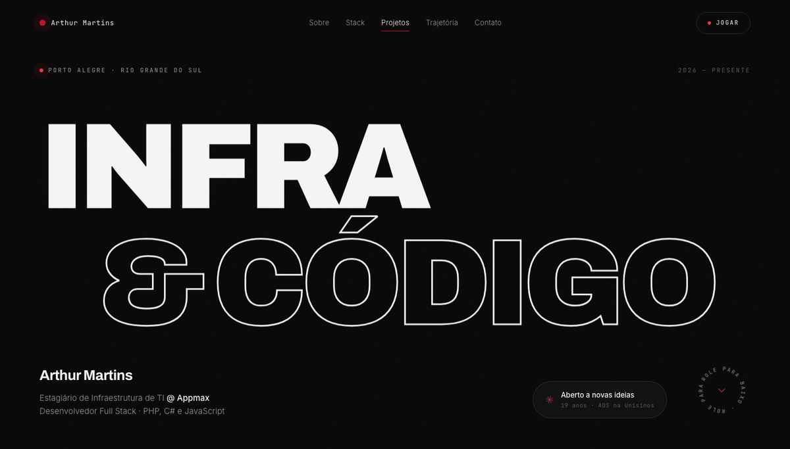
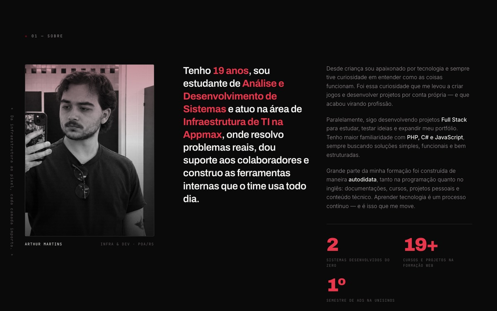
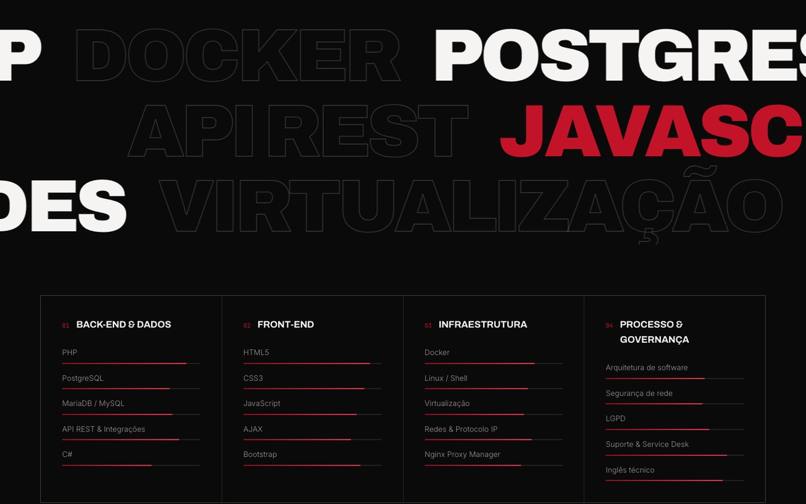
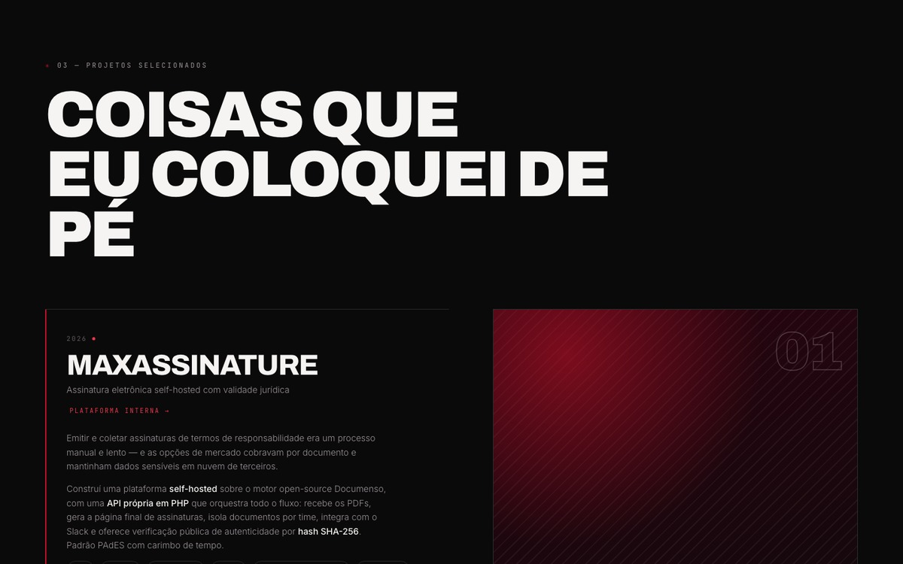
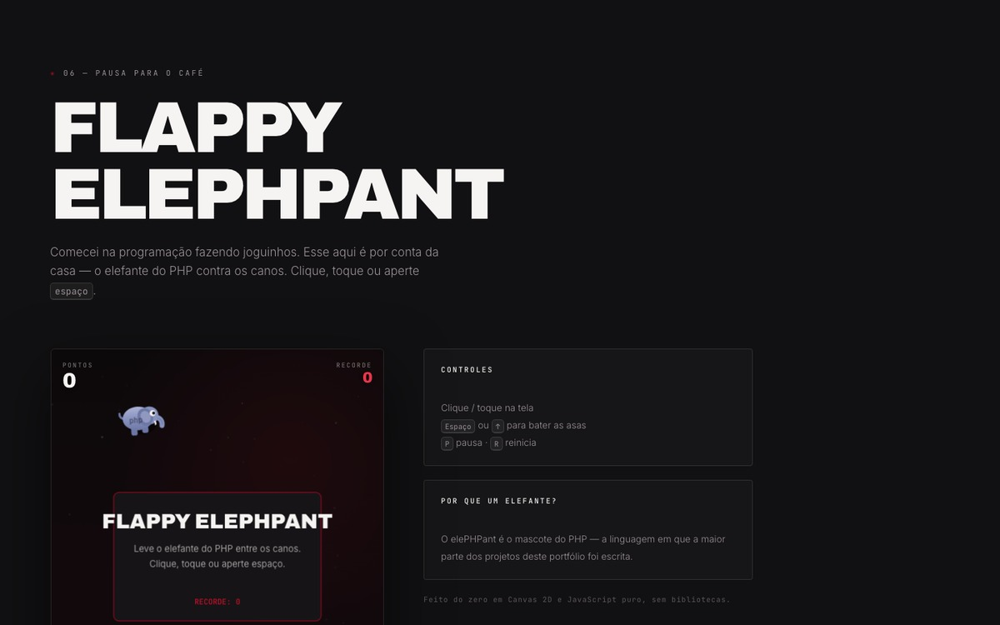

<div align="center">



<br><br>

# Portfólio · Arthur Martins

**Infraestrutura de TI &amp; desenvolvimento Full Stack**

Site pessoal de página única, escrito à mão em HTML, CSS e JavaScript.<br>
Sem framework, sem build, sem `node_modules` — é só abrir o `index.html`.

<br>


<br>

[**Ver o site**](#-rodando-localmente) · [Sobre mim](#-sobre-o-projeto) · [Mini game](#-flappy-elephpant) · [Deploy](#-deploy-no-netlify)

</div>

<br>

---

## ✳ Sobre o projeto

Tenho 19 anos, estudo **Análise e Desenvolvimento de Sistemas** na Unisinos e trabalho com
**Infraestrutura de TI na Appmax**, onde também desenvolvo as ferramentas internas do time.

Este repositório é o meu portfólio — e ele é, ao mesmo tempo, uma amostra do trabalho e
uma peça do trabalho. Decidi construir tudo do zero, sem framework, justamente porque a
proposta era mostrar domínio do básico bem feito: semântica, layout, animação e
um pouco de Canvas.

**Paleta:** bordô `#8E0E22` · preto `#0A0A0A` · branco `#F6F4F2`

<br>

## ✳ O que tem aqui

| | |
|---|---|
| **Página única** | Sete seções: hero, sobre, competências, projetos, trajetória, certificados, contato — mais o mini game. |
| **Zero dependências** | Nenhum pacote, nenhum bundler. Só as fontes do Google Fonts via `<link>`. |
| **Preloader com contador** | Barra de progresso e porcentagem, com trava de segurança para nunca prender o visitante. |
| **Cursor personalizado** | Segue o mouse com interpolação e cresce sobre elementos interativos (desligado no toque). |
| **Botões magnéticos** | Elementos marcados com `data-magnet` se inclinam na direção do cursor. |
| **Animação no scroll** | `IntersectionObserver` para revelar blocos, animar as barras de competência e contar números. |
| **Tipografia que deriva** | As palavras gigantes da seção de stack se deslocam conforme a página rola. |
| **Projetos interativos** | Lista à esquerda, pré-visualização fixa à direita, sincronizada com o scroll e navegável por teclado. |
| **Formulário sem back-end** | Netlify Forms com honeypot anti-spam e página de confirmação própria. |
| **Acessível** | Marcação semântica, foco por teclado, `aria-label` nos controles e respeito a `prefers-reduced-motion`. |
| **Responsivo de verdade** | Testado de 375 px até 1440 px, com menu em tela cheia no mobile. |

<br>

## ✳ Galeria

<div align="center">







</div>

<br>

## ✳ Flappy ElePHPant


Comecei na programação fazendo joguinhos, então o portfólio não ia terminar sem um.

É um Flappy Bird em que o pássaro virou o **elePHPant**, o mascote do PHP — a linguagem
em que a maior parte dos projetos aqui foi escrita. Feito do zero em **Canvas 2D**,
sem biblioteca nenhuma: o elefante é desenhado com `arc`, `ellipse` e curvas de Bézier,
quadro a quadro.

**Controles**

| Tecla | Ação |
|---|---|
| Clique / toque | Bater as asas |
| <kbd>Espaço</kbd> ou <kbd>↑</kbd> | Bater as asas |
| <kbd>P</kbd> | Pausar |
| <kbd>R</kbd> | Reiniciar |

Tem física com delta-time, dificuldade progressiva, partículas, tremida na colisão,
efeitos sonoros via Web Audio (desligados por padrão) e recorde salvo no `localStorage`.
O jogo pausa sozinho quando sai da tela, para não gastar bateria à toa.

Para mexer na dificuldade, as constantes estão no topo de [`js/game.js`](js/game.js):

```js
var GRAVITY     = 1400;   // px/s²
var FLAP        = -430;   // impulso ao bater as asas
var GAP_START   = 208;    // vão inicial entre os canos
var GAP_MIN     = 162;    // vão mínimo, no limite da dificuldade
var SPEED_START = 158;    // velocidade inicial
var SPAWN_X     = 290;    // distância entre um cano e outro
```

<br clear="right">

## ✳ Estrutura

```
portfolio/
├── index.html              página única, todas as seções
├── obrigado.html           confirmação de envio do formulário
├── css/
│   └── style.css           estilos, tokens de cor e responsividade
├── js/
│   ├── main.js             preloader, cursor, scroll, reveals, projetos
│   └── game.js             Flappy ElePHPant (Canvas 2D)
├── assets/                 retrato, imagem social e ícones
├── docs/preview/           capturas usadas neste README
├── netlify.toml            publicação, cache e headers de segurança
└── robots.txt
```

<br>

## ✳ Rodando localmente

Como não há build, qualquer servidor estático resolve:

```bash
python3 -m http.server 4173
```

Depois é só abrir <http://localhost:4173>.

Também funciona no **XAMPP** — copie a pasta para `htdocs/` e acesse
`http://localhost/portfolio/`. Abrir o `index.html` direto no navegador
funciona para quase tudo, mas o formulário só responde publicado.

<br>

## ✳ Deploy no Netlify

**Arrastar e soltar** — o caminho mais rápido:

1. Acesse [app.netlify.com/drop](https://app.netlify.com/drop)
2. Arraste a pasta do projeto inteira
3. Renomeie o site em *Site settings → Change site name*

**Pelo Git** — recomendado, porque cada `push` republica sozinho:

No Netlify, *Add new site → Import an existing project*, escolha este repositório
e confirme. O [`netlify.toml`](netlify.toml) já diz que não há build, que a pasta a
publicar é a raiz e define cache e headers de segurança.

### Formulário de contato

Usa o **Netlify Forms**, então não existe back-end nenhum. Com o site no ar, as
mensagens aparecem em *Site → Forms → contato*. Para receber por e-mail:
*Site settings → Forms → Form notifications → Add notification*.

O formulário tem honeypot anti-spam e redireciona para `obrigado.html` depois do envio.

<br>

## ✳ Projetos em destaque no site

| Projeto | O que é |
|---|---|
| **MaxAssinature** | Plataforma de assinatura eletrônica self-hosted com validade jurídica (PAdES + carimbo de tempo), construída sobre o Documenso com uma API própria em PHP. |
| **Painel TI** | Dashboard pessoal de organização: demandas em kanban, agenda, metas e notas, com gráficos em SVG desenhados na mão. |
| **Kanban GLPI + Jira** | Plugin em PHP que traz o quadro do Jira para dentro do GLPI, sem precisar trocar de sistema. |

<br>

## ✳ Contato

<div align="center">

[](https://www.linkedin.com/in/arthur-martins-2720782b7/)
[](https://github.com/ZarthDev)
[](https://blogdoarthur.infinityfree.me)

Porto Alegre · Rio Grande do Sul · Brasil

</div>

<br>

## ✳ Licença

[MIT](LICENSE) — sinta-se à vontade para usar o código como referência.
Só peço que o conteúdo pessoal (textos, foto e projetos) fique comigo. 🙂

<div align="center">
<br>
<sub>Feito à mão com HTML, CSS e JavaScript — e um elefante.</sub>
</div>
